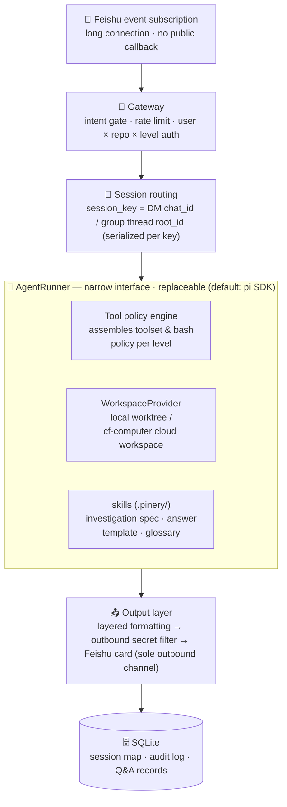

<div align="center">

<a name="readme-top"></a>


# Pinery

**Your engineering teammate in Feishu/Lark — anyone can ask it about code; engineers can dispatch it to write code and open PRs**

*自托管 · 多模型 · 分级授权 — 飞书里的工程同事。*

[](LICENSE)
[](tsconfig.base.json)
[](https://bun.sh)
[](https://nodejs.org)
[](#-model-providers)
[](#%EF%B8%8F-roadmap)
[](CONTRIBUTING.md)

[Features](#-features) · [Quick Start](#-quick-start) · [Model Providers](#-model-providers) · [Architecture](#%EF%B8%8F-architecture) · [Security](#-security-model-summary) · [Roadmap](#%EF%B8%8F-roadmap) · [Contributing](#-contributing)

[简体中文](README.md) · **English**

</div>

---

> [!NOTE]
> Pinery is in **M1**: the L0 read-only investigation capability is code-complete and being validated on our own projects ("ask a question → get a trustworthy answer"). Feedback is very welcome; the config format may change before 1.0.

There is no Feishu/Lark equivalent of "Codex in Slack" — and for many teams (especially in China) the code lives on an internal network where SaaS can never reach. So Pinery is **self-hosted and open source by design**: single-container deployment, Feishu long-connection events (no public callback URL needed), and models via OpenRouter or any of 26+ providers.

## 🎯 What it solves

1. **The gap between non-technical roles and the source of truth (the code)**: PMs/QA want to know "does the implementation match the requirement?" — the answer lives in code, and today they have to grab an engineer to investigate and relay. Pinery lets them ask directly in Feishu and get an answer **with evidence and a confidence level**.
2. **The gap between engineers and the IM workflow**: requirements are discussed in Feishu, execution happens in the IDE/CLI, and context is carried by hand. Pinery takes a task from a Feishu thread straight into an isolated workspace, and posts the PR link back to the thread.

Once configured, mention @Pinery in a group chat:

> **@Pinery Does an order auto-refund on payment timeout?**
>
> 🔍 Investigating → ✅ layered answer card: **conclusion** / collapsible **evidence** (file:line) / **confidence & boundaries**

## ✨ Features

- 🏠 **Self-hosted, code never leaves your network** — single container, Feishu long-connection events, no public callback URL
- ☁️ **Or fully cloud-native** — the same core runs entirely on Cloudflare (Agents SDK + Computer + AI Gateway), no server to operate
- 🔌 **Switch models freely** — 26+ providers out of the box via pi-ai, with gateway rerouting and local models (vLLM / Ollama)
- 🎚️ **Leveled autonomy** — from L0 read-only to L3 dangerous ops, enforced per user × repo × level
- 🧩 **Two replaceable narrow interfaces** — AgentRunner and WorkspaceProvider are both narrow interfaces; pi is just the default implementation, and community alternatives for both are welcome
- 🛡️ **Defense in depth** — tool allowlists, workspace path fencing, outbound secret filtering, egress allowlist proxy, audit logging
- 📋 **Auditable answers** — layered cards with file:line evidence and confidence; every tool call and Q&A is recorded (golden set)

## 🎚️ Capability levels

| Level | Capability | Granted to | Status |
|---|---|---|---|
| **L0 Observe** | Read-only investigation, Q&A, PRD cross-checks | Any authorized user (incl. non-technical) | ✅ M1 |
| **L1 Write** | Write code in isolated worktrees, run tests, commit | Authorized engineers | 🚧 M2 |
| **L2 Deliver** | Push `pinery/*` branches, open PRs (card confirmation) | Authorized engineers | 🚧 M3 |
| **L3 Dangerous** | Merge, deploy, change CI | Disabled by default; allowlist + approval | 📋 P2 |

## 🚀 Quick Start

Prerequisites: Feishu admin access (to create the app), an API key for any model provider (see [Model Providers](#-model-providers)), and [Bun](https://bun.sh) ≥ 1.2 or Docker.

```bash
# 1. Install dependencies and build (Bun is the first-class runtime; Node ≥ 22.13 also works)
bun install && bun run build

# 2. Generate config (interactive; picks a model setup and prints the Feishu console checklist)
bun packages/adapter/dist/cli/main.js init

# 3. Configure the Feishu app per the checklist (~10 min, see docs/feishu-setup.md), fill in .env

# 4. Self-check → generate glossary → start
bun packages/adapter/dist/cli/main.js doctor --online
bun packages/adapter/dist/cli/main.js bootstrap
bun packages/adapter/dist/cli/main.js start
```

### 🐳 Docker (recommended for production)

```bash
cd deploy/docker
cp .env.example .env   # fill in secrets; put pinery.yaml in the same directory
docker compose up -d
```

> [!TIP]
> For production, use the **hardened compose** ([compose.hardened.yaml](deploy/docker/compose.hardened.yaml)): the app container sits on an `internal` network (no external routing), all egress goes through a self-hosted allowlist proxy, plus `cap_drop: ALL` / `no-new-privileges` / pids and memory limits.
>
> ```bash
> docker compose -f compose.hardened.yaml up -d
> ```

### ☁️ Cloudflare (cloud-native, no server required)

Pinery can also run **entirely on Cloudflare**: Feishu events arrive via webhook into a Worker, sessions and the agent loop run on the Agents SDK (Durable Objects + Fibers), workspaces use `@cloudflare/computer`, and models route through AI Gateway. Same core code as the local form — each is the other's rollback path.

```bash
cd deploy/cloudflare && bun install
# put pinery.yaml into wrangler.jsonc vars.PINERY_CONFIG; secrets via wrangler secret put
bunx wrangler deploy
```

See [deploy/cloudflare/README.md](deploy/cloudflare/README.md) for setup and [docs/cloudflare-architecture.md](docs/cloudflare-architecture.md) for the architecture and decision record. Best for overseas Lark tenants, public demos, and repos already on GitHub/GitLab SaaS; internal-network repos should stay on the Docker path above (long connection, no public callback).

## 🧠 Model Providers

The model layer is powered by pi-ai with **26+ providers out of the box** (anthropic / openai / google / deepseek / openrouter / groq / xai / mistral / cerebras / zai / minimax / cloudflare-workers-ai / vercel-ai-gateway / azure-openai-responses …). API keys are read from each provider's conventional environment variable. Three setups (full annotated example: [examples/pinery.example.yaml](examples/pinery.example.yaml)):

```yaml
# A. Direct official / aggregator provider: just change provider + id, zero extra config
model: { provider: anthropic, id: claude-sonnet-4-5 }        # ANTHROPIC_API_KEY
model: { provider: deepseek, id: deepseek-chat }             # DEEPSEEK_API_KEY
model: { provider: openrouter, id: deepseek/deepseek-chat }  # OPENROUTER_API_KEY (default)

# B. Reroute via Cloudflare AI Gateway (unified observability/caching/BYOK): built-in providers only need base_url
model:
  provider: anthropic
  id: claude-sonnet-4-5
  base_url: https://gateway.ai.cloudflare.com/v1/<acct>/<gateway>/anthropic
  headers: { cf-aig-authorization: CF_AIG_HEADER }   # gateway auth; value may be an env var name

# C. Custom OpenAI-compatible endpoint / local models (vLLM, Ollama, internal gateways)
model:
  provider: my-gateway
  id: qwen3-coder
  api: openai-completions
  base_url: http://127.0.0.1:11434/v1
```

<details>
<summary><b>Implementation detail: declarative generation of pi's models.json</b></summary>
<br/>

base_url / api / headers overrides declaratively generate pi's `models.json` registration file (inside Pinery's dedicated agentDir): built-in providers are rerouted at the provider level, custom providers are registered as custom models; apiKey and header values support "env var name references" so secrets never touch disk. When `runner.kind` swaps the harness, this mechanism travels with the runner implementation.

</details>

## 🏗️ Architecture



Design principles (full decision record in PRD v0.2, "self-interrogation" section):

- **The AgentRunner narrow interface is a first-class citizen**: pi is an implementation detail, not the product's identity — community harnesses like `runner-claude-code` are welcome (switch via `runner.kind`).
- **WorkspaceProvider is symmetrically replaceable**: the workspace backend is also a narrow interface — local worktrees and cloud sandboxes (Cloudflare Computer) share the same policy engine and session model; switching is just `workspace.provider`.
- **The reply channel is funneled through the adapter**: the agent has no message-sending tool; lark-cli only reads Feishu docs.
- **Feishu cards only authorize execution** — code review stays entirely on your Git platform. Pinery doesn't try to replace any part of it; it only delivers tasks into it.
- **Glossary cold-start is automated**: `pinery bootstrap` has the agent scan the repo and draft a glossary; engineers only review and correct.

## 📦 Repository layout

```
pinery/
├── packages/
│   ├── core/                  # AgentRunner narrow interface · config schema · bash policy engine · secret filter
│   ├── adapter/               # Feishu long-connection ↔ AgentRunner bridge (the core) + pinery CLI
│   ├── runner-pi/             # Default AgentRunner implementation (pi SDK + tool policy assembly + worktree)
│   ├── workspace-cf-computer/ # Cloud workspace backend (Cloudflare Computer, experimental)
│   ├── lark-cli/              # Agent-side read-only Feishu docs CLI (foundation for PRD cross-checks)
│   └── skills/                # Investigation spec · answer template · glossary template · task spec
├── deploy/
│   ├── docker/                # Primary deployment path (incl. hardened egress compose)
│   └── cloudflare/            # Cloud-native form (webhook + Agents SDK + Computer workspace)
├── docs/                      # Threat model · sandbox evaluation · Feishu setup guide
└── examples/                  # Fully annotated config examples
```

## 🛠️ CLI

| Command | Purpose |
|---|---|
| `pinery init` | Interactively generate pinery.yaml + print the Feishu console checklist |
| `pinery doctor [--online]` | Deployment self-check (config/env/credentials, item by item) |
| `pinery bootstrap [--offline]` | Agent scans the repo to draft a glossary + installs default skills |
| `pinery start` | Start the long-connection resident service |
| `pinery repo sync [--watch N]` | Clone/pull repos (usable as a sidecar) |
| `pinery golden list/mark/export` | Q&A labeling and export (foundation of the eval loop; every question is recorded) |

In-conversation commands: `help` usage · `status` repo & session state · `取消` (cancel) aborts the current investigation.

## 🔐 Security model (summary)

- Authorization is enforced in the Gateway by Feishu user_id, before any agent logic runs
- L0 tool allowlist (read-only commands; no redirection/substitution/script execution) + workspace path fencing + sanitized bash subprocess environment
- All outbound text passes a secret filter based on a subset of gitleaks rules
- **Egress allowlisting**: the hardened compose puts the app on an `internal` network; all egress goes through a self-hosted allowlist proxy (default deny)
- L1+ relies on the container boundary — **do not enable write capabilities outside a container**

> [!IMPORTANT]
> Read the **[threat model and known limitations](docs/threat-model.md)** before deploying.
> Sandbox evaluation and the cloud path design (CF Computer first): [docs/sandbox-evaluation.md](docs/sandbox-evaluation.md).
> Report vulnerabilities via [private reporting](https://github.com/Iris-Ares/Pinery/security/advisories/new), not public issues — see [SECURITY.md](SECURITY.md).

## 🗺️ Roadmap

| Milestone | Scope | Status |
|---|---|---|
| **M1** | Docker + adapter + runner-pi (L0) + single repo + thread sessions + layered cards + bootstrap | ✅ Code-complete; acceptance = "question → trustworthy answer" on our own projects |
| **M2** | L1 coding tasks (worktree + test execution) + multi-turn hardening + 20-question blind eval | 🚧 Next (non-technical rollout gated on the blind eval) |
| **M3** | L2 PR loop + full group-chat support + lark-cli / PRD cross-checks + file-level dependency cache | 📋 Planned |
| **M4** | Eval loop + curated FAQ + multi-repo + trajectory pages + open-source launch | 📋 Planned |

## 🧑‍💻 Development

```bash
bun install
bun run build     # tsc -b across the workspace
bun run test      # vitest (policy engine / filters / cards / end-to-end orchestration, 120+ cases)
```

Dual runtime support: **Bun ≥ 1.2 (recommended; the Docker image is based on oven/bun)** or Node ≥ 22.13. SQLite picks the built-in driver per runtime (`bun:sqlite` / `node:sqlite`) — zero native build dependencies.

## 🤝 Contributing

Contributions of every kind are welcome — bug reports, ideas, docs, tests, or an alternative runner / workspace backend (`runner-claude-code` has a seat waiting).

- Contributing guide: [CONTRIBUTING.md](CONTRIBUTING.md)
- Code of conduct: [CODE_OF_CONDUCT.md](CODE_OF_CONDUCT.md)
- Security policy: [SECURITY.md](SECURITY.md)

## ⭐ Star History

<div align="center">

<a href="https://star-history.com/#Iris-Ares/Pinery&Date">
  <picture>
    <source media="(prefers-color-scheme: dark)" srcset="https://api.star-history.com/svg?repos=Iris-Ares/Pinery&type=Date&theme=dark" />
    <source media="(prefers-color-scheme: light)" srcset="https://api.star-history.com/svg?repos=Iris-Ares/Pinery&type=Date" />
    
  </picture>
</a>

</div>

## 📄 License

[MIT](LICENSE) — positioned as an open-source community project with no commercial presets; commercial hosting and derivative work are welcome.

<div align="center">
<br/>

🌲 *Bringing the engineering source of truth into Feishu.*

<a href="#readme-top">⬆ Back to top</a>

</div>
