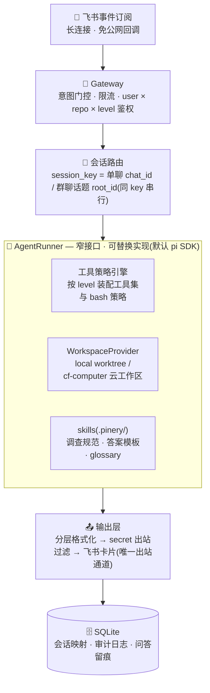

<div align="center">

<a name="readme-top"></a>


# Pinery

**飞书里的工程同事 —— 任何人可以问它代码,工程师可以派它写代码、提 PR**

*Your engineering teammate in Feishu/Lark — self-hosted, multi-model, leveled autonomy.*

[](LICENSE)
[](tsconfig.base.json)
[](https://bun.sh)
[](https://nodejs.org)
[](#-模型接入)
[](#%EF%B8%8F-路线图)
[](CONTRIBUTING.md)

[核心特性](#-核心特性) · [快速开始](#-快速开始) · [模型接入](#-模型接入) · [架构](#%EF%B8%8F-架构) · [安全模型](#-安全模型摘要) · [路线图](#%EF%B8%8F-路线图) · [参与贡献](#-参与贡献)

**简体中文** · [English](README.en.md)

</div>

---

> [!NOTE]
> Pinery 处于 **M1 阶段**:L0 只读调查能力代码就绪,正在自有项目上验收「提问 → 可信答案」。欢迎试用与反馈,配置格式在 1.0 前可能变动。

「Codex in Slack」的飞书版不存在,而国内团队大量代码在内网,SaaS 形态永远进不来——所以 Pinery 生来就是**自托管开源**的:单容器部署,飞书长连接接入(免公网回调),模型走 OpenRouter 等 26+ provider 自由切换。

## 🎯 它解决什么

1. **非技术角色与代码事实源的断层**:产品/QA 想知道「工程实现是否符合需求」,答案在代码里,现状是抓工程师人肉调查转述。Pinery 让他们直接在飞书里问,得到**带依据、带置信度**的答案。
2. **工程师与 IM 工作流的断层**:需求讨论在飞书,执行在 IDE/CLI,上下文靠人肉搬运。Pinery 让任务从飞书话题直接进入隔离工作区,PR 链接回贴话题。

配好后,在群里 @Pinery 提问:

> **@Pinery 下单超时会自动退款吗?**
>
> 🔍 调查中 → ✅ 分层答案卡片:**结论** / 可折叠**依据**(文件:行号)/ **置信度与边界**

## ✨ 核心特性

- 🏠 **自托管,代码不出内网** — 单容器部署,飞书长连接接入,无需公网回调地址
- 🔌 **多模型自由切换** — pi-ai 26+ provider 开箱即用,支持网关改道与本地模型(vLLM / Ollama)
- 🎚️ **能力分级授权** — L0 只读 → L3 危险操作逐级放权,user × repo × level 硬判鉴权
- 🧩 **双窄接口可替换** — AgentRunner 与 WorkspaceProvider 皆是窄接口,pi 只是默认实现,harness 与工作区后端都欢迎社区替代
- 🛡️ **纵深安全** — 工具白名单、路径围栏、secret 出站过滤、egress 白名单代理、审计落库
- 📋 **答案可审计** — 依据到文件:行号、附置信度的分层卡片;每次工具调用与问答留痕(golden set)

## 🎚️ 能力分级

| 级别 | 能力 | 授权对象 | 状态 |
|---|---|---|---|
| **L0 观察** | 只读调查、问答、PRD 对照 | 任何授权用户(含非技术) | ✅ M1 |
| **L1 编写** | 隔离 worktree 写代码、跑测试、commit | 授权工程师 | 🚧 M2 |
| **L2 交付** | push `pinery/*` 分支、创建 PR(卡片确认) | 授权工程师 | 🚧 M3 |
| **L3 危险** | merge、部署、改 CI | 默认禁用,白名单+审批 | 📋 P2 |

## 🚀 快速开始

前置:飞书管理员权限(建应用)、任一模型 API key(见[模型接入](#-模型接入))、[Bun](https://bun.sh) ≥ 1.2 或 Docker。

```bash
# 1. 安装依赖并构建(Bun 为一等运行时;Node ≥ 22.13 亦可)
bun install && bun run build

# 2. 生成配置(交互式;含模型接入方式选择,同时打印飞书后台配置清单)
bun packages/adapter/dist/cli/main.js init

# 3. 按清单配置飞书应用(约 10 分钟,详见 docs/feishu-setup.md),填好 .env

# 4. 自检 → 生成术语表 → 启动
bun packages/adapter/dist/cli/main.js doctor --online
bun packages/adapter/dist/cli/main.js bootstrap
bun packages/adapter/dist/cli/main.js start
```

### 🐳 Docker 部署(生产建议)

```bash
cd deploy/docker
cp .env.example .env   # 填入 secrets;pinery.yaml 放同目录
docker compose up -d
```

> [!TIP]
> 生产环境建议用**加固编排**([compose.hardened.yaml](deploy/docker/compose.hardened.yaml)):应用容器挂 `internal` 网络(无外部路由),出网只能经自建 egress 白名单代理,叠加 `cap_drop: ALL` / `no-new-privileges` / pids 与内存限额。
>
> ```bash
> docker compose -f compose.hardened.yaml up -d
> ```

## 🧠 模型接入

模型层由 pi-ai 承担,**26+ provider 开箱即用**(anthropic / openai / google / deepseek / openrouter / groq / xai / mistral / cerebras / zai / minimax / cloudflare-workers-ai / vercel-ai-gateway / azure-openai-responses …),API key 按各家惯例环境变量读取。三种接入形态(完整示例见 [examples/pinery.example.yaml](examples/pinery.example.yaml)):

```yaml
# A. 官方 / 聚合 provider 直连:换 provider + id 即可,零额外配置
model: { provider: anthropic, id: claude-sonnet-4-5 }        # ANTHROPIC_API_KEY
model: { provider: deepseek, id: deepseek-chat }             # DEEPSEEK_API_KEY
model: { provider: openrouter, id: deepseek/deepseek-chat }  # OPENROUTER_API_KEY(默认)

# B. Cloudflare AI Gateway 改道(统一观测/缓存/BYOK):内置 provider 只需 base_url
model:
  provider: anthropic
  id: claude-sonnet-4-5
  base_url: https://gateway.ai.cloudflare.com/v1/<acct>/<gateway>/anthropic
  headers: { cf-aig-authorization: CF_AIG_HEADER }   # 网关鉴权,值可写 env 变量名

# C. 自定义 OpenAI 兼容端点 / 本地模型(vLLM、Ollama、内网网关)
model:
  provider: my-gateway
  id: qwen3-coder
  api: openai-completions
  base_url: http://127.0.0.1:11434/v1
```

<details>
<summary><b>实现细节:声明式生成 pi 的 models.json</b></summary>
<br/>

base_url / api / headers 覆写会声明式生成 pi 的 `models.json` 注册文件(位于 Pinery 专属 agentDir):内置 provider 走 provider 级改道,自定义 provider 注册为自定义模型;apiKey 与 headers 值支持「环境变量名引用」,secret 不落盘。`runner.kind` 换 harness 时该机制随 runner 实现走。

</details>

## 🏗️ 架构



设计要点(完整决策记录见 PRD v0.2 的自我拷问一节):

- **AgentRunner 窄接口是一等公民**:pi 是实现细节不是产品身份,欢迎社区实现 `runner-claude-code` 等替代 harness(配置 `runner.kind` 即可切换)。
- **WorkspaceProvider 同构可替换**:工作区后端也是窄接口——本地 worktree 与云沙箱(Cloudflare Computer)共用同一套策略引擎与会话模型,切换只改 `workspace.provider`。
- **回复通道收口在 adapter**:agent 没有发消息的工具;lark-cli 只读飞书文档。
- **飞书卡片只做执行授权**,code review 完全留在 Git 平台——Pinery 不试图取代 Git 平台的任何环节,只负责把任务送进去。
- **glossary 冷启动自动化**:`pinery bootstrap` 让 agent 自扫仓库生成术语表草稿,工程师只 review 修正。

## 📦 仓库结构

```
pinery/
├── packages/
│   ├── core/                  # AgentRunner 窄接口 · 配置 schema · bash 策略引擎 · secret 过滤
│   ├── adapter/               # 飞书长连接 ↔ AgentRunner 桥(核心)+ pinery CLI
│   ├── runner-pi/             # AgentRunner 默认实现(pi SDK + 工具策略装配 + worktree)
│   ├── workspace-cf-computer/ # 云工作区后端(Cloudflare Computer,实验)
│   ├── lark-cli/              # agent 侧只读飞书文档 CLI(PRD 对照场景的地基)
│   └── skills/                # 调查规范 · 答案模板 · glossary 模板 · 任务规范
├── deploy/
│   ├── docker/                # 主部署路径(含 egress 加固编排)
│   └── cloudflare/            # 云路径 Worker(DO + Computer 工作区)
├── docs/                      # 威胁模型 · 沙箱选型 · 飞书配置教程
└── examples/                  # 注释完整的配置示例
```

## 🛠️ CLI

| 命令 | 作用 |
|---|---|
| `pinery init` | 交互生成 pinery.yaml + 打印飞书后台配置清单 |
| `pinery doctor [--online]` | 部署自检(配置/环境/凭据逐项校验) |
| `pinery bootstrap [--offline]` | agent 自扫仓库生成 glossary 草稿 + 安装默认 skills |
| `pinery start` | 启动长连接常驻服务 |
| `pinery repo sync [--watch N]` | 克隆/拉取仓库(可作 sidecar) |
| `pinery golden list/mark/export` | 问答标注与导出(评估闭环的地基,每问自动留痕) |

会话内指令:`help` 使用说明 · `status` 仓库与会话状态 · `取消` 中断当前调查。

## 🔐 安全模型(摘要)

- 鉴权在 Gateway 按飞书 user_id 硬判,先于一切 agent 逻辑
- L0 工具白名单(只读命令、禁重定向/替换/脚本执行)+ 工作区路径围栏 + bash 子进程环境净化
- 所有出站文本过 gitleaks 规则子集的 secret 过滤
- **网络出口白名单**:加固编排把应用放进 `internal` 网络,出网只经自建白名单代理(默认拒绝)
- L1+ 依赖容器边界,**请勿在容器外开启写能力**

> [!IMPORTANT]
> 部署前请务必阅读**[威胁模型与已知限制](docs/threat-model.md)**。
> 沙箱选型与云路径设计(CF Computer 优先):[docs/sandbox-evaluation.md](docs/sandbox-evaluation.md)。
> 安全漏洞请走[私密报告](https://github.com/Iris-Ares/Pinery/security/advisories/new),勿开公开 issue,详见 [SECURITY.md](SECURITY.md)。

## 🗺️ 路线图

| 里程碑 | 内容 | 状态 |
|---|---|---|
| **M1** | Docker + adapter + runner-pi(L0)+ 单 repo + 话题会话 + 分层卡片 + bootstrap | ✅ 代码就绪,验收=自有项目跑通「提问→可信答案」 |
| **M2** | L1 编码任务(worktree + 测试执行)+ 多轮强化 + 20 题盲评 | 🚧 下一步(盲评达标才对非技术用户放量) |
| **M3** | L2 PR 闭环 + 群聊完整 + lark-cli/PRD 对照 + 文件级依赖缓存 | 📋 规划 |
| **M4** | 评估闭环 + 手动 FAQ + 多 repo + 轨迹页 + 开源发布 | 📋 规划 |

## 🧑‍💻 开发

```bash
bun install
bun run build     # tsc -b 全 workspace
bun run test      # vitest(策略引擎/过滤器/卡片/编排端到端 120+ 用例)
```

运行时双支持:**Bun ≥ 1.2(推荐,Docker 镜像基于 oven/bun)** 或 Node ≥ 22.13。SQLite 按运行时自动选择内置驱动(`bun:sqlite` / `node:sqlite`),零原生编译依赖。

## 🤝 参与贡献

欢迎任何形式的贡献——报 bug、提想法、写文档、补测试,或实现一个替代 runner / workspace 后端(`runner-claude-code` 虚位以待)。

- 贡献指南:[CONTRIBUTING.md](CONTRIBUTING.md)
- 行为准则:[CODE_OF_CONDUCT.md](CODE_OF_CONDUCT.md)
- 安全策略:[SECURITY.md](SECURITY.md)

## ⭐ Star History

<div align="center">

<a href="https://star-history.com/#Iris-Ares/Pinery&Date">
  <picture>
    <source media="(prefers-color-scheme: dark)" srcset="https://api.star-history.com/svg?repos=Iris-Ares/Pinery&type=Date&theme=dark" />
    <source media="(prefers-color-scheme: light)" srcset="https://api.star-history.com/svg?repos=Iris-Ares/Pinery&type=Date" />
    
  </picture>
</a>

</div>

## 📄 License

[MIT](LICENSE) — 开源社区项目定位,不做商业化预设;欢迎商业托管与二次开发。

<div align="center">
<br/>

🌲 *把工程事实源带进飞书。*

<a href="#readme-top">⬆ 回到顶部</a>

</div>
